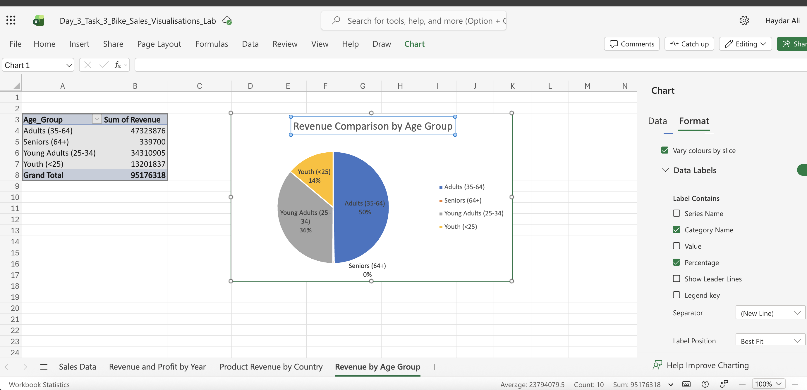
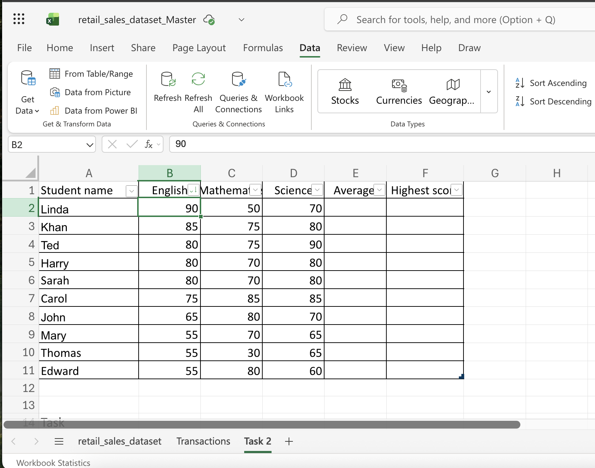

Week 1 – Introduction to Data & Excel

Topics covered:
Excel data analysis

Pivot tables and formulas

Sales and revenue analysis

Data visualisation

Churn analysis

Business reporting

I used Excel and corporate datasets to execute a variety of fundamental data tasks in this worksheet. I focused on data organisation and analysis, summarising information and finding helpful trends using pivot tables, tables, and algorithms. In order to make the results easier to understand, I additionally classified the data using Excel tools like SWITCH and made visualisations. Alongside the practical data work, I covered crucial data protection and legal themes, including GDPR and the safe treatment of consumer data. In addition, I studied revenue, sales, and churn analysis and practised clearly and professionally presenting information to key stakeholders.
Project visuals

# Data Technician Workbook 1

## Overview

In this workbook, I completed a range of core data tasks using Excel and business datasets. I worked on organising and analysing data, using formulas, tables, and pivot tables to summarise information and identify useful patterns. I also categorised data with functions such as SWITCH and created visualisations in Excel to present findings more clearly. Alongside the practical data work, I covered key data protection and legal topics, including GDPR and the responsible handling of customer data. I also explored churn, sales, and revenue analysis, and practised communicating insights in a clear and professional way for senior stakeholders.

## Topics Covered

- Excel data analysis
- Pivot tables and formulas
- Sales and revenue analysis
- Data visualisation
- Churn analysis
- Business reporting
- Data protection and GDPR
