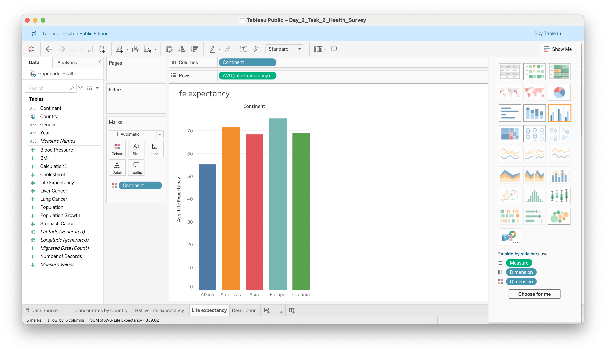
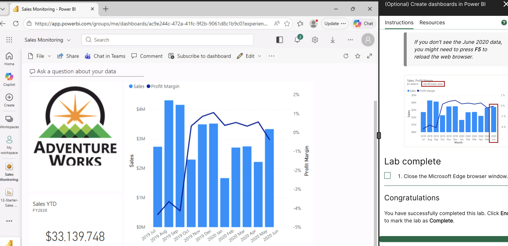

# Week 2 - Introduction to Tableau & Power BI

## Overview

I used Tableau and Power BI in this workbook to analyse patterns across several datasets, create dashboards, and explore data. I looked into the various Tableau editions and described Tableau Public's limitations for business use. Using the EMSI Job Change UK dataset, I also produced visual outputs, including a UK map that highlights affected city areas and a bar chart that shows the percentage change. In addition, I examined health and Spotify datasets to find trends and extract useful information.

Additionally, I completed Power BI Desktop labs covering data retrieval, loading converted data, report design, and dashboard creation. My abilities to create dashboards, analyse trends, visualise data, and use data to inform decisions have all improved as a result of my work.

## Topics Covered

- Tableau versions and Tableau Public limitations
- Dashboard creation in Tableau
- Bar charts and map visualisations
- Trend analysis using Spotify data
- Health data analysis and insight generation
- Power BI data loading and transformation
- Report design in Power BI
- Dashboard creation in Power BI

