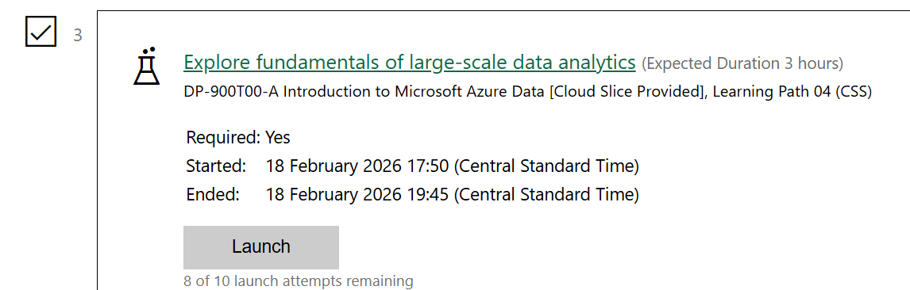

## Week 5 - Fundamentals of Azure

I improved my knowledge of cloud computing, Azure data services, and the security and legal considerations associated with handling company data by using this worksheet. I studied important cloud ideas, contrasted cloud service models and providers, and finished Azure labs on data analytics, relational data, and non-relational data. Additionally, I used this knowledge in an Azure data proposal for a business scenario, where I made service recommendations, created a data model, took storage formats into account, and made plans for security, backup, reporting, and future expansion.

## Topics Covered

- Cloud computing concepts
- Azure data services
- Relational and non relational data in Azure
- Data modelling and storage design
- Data protection and cyber security laws
- Azure security, backup, and recovery

Project visuals:

