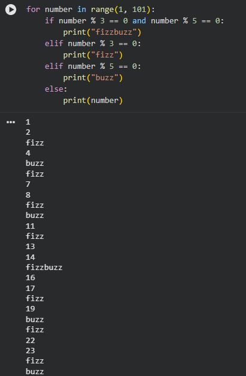
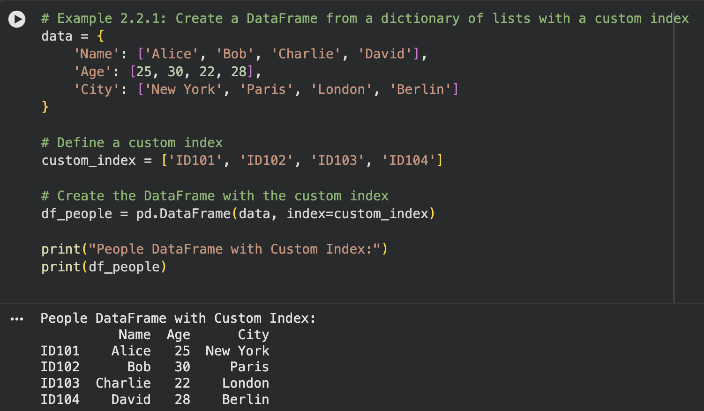
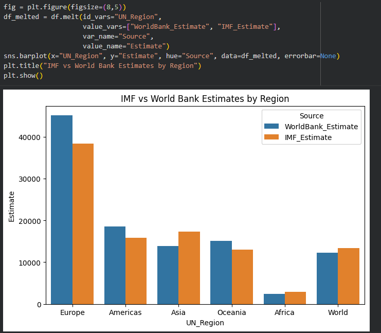

## Week 6 - Introduction to Python

Through a combination of coding exercises and data analysis activities, this workbook helped me improve my Python and Pandas skills. I worked with CSV datasets in Jupyter Notebook to import, analyse, filter, and alter data using Pandas after finishing a Python FizzBuzz challenge. Key actions, including indexing, slicing, renaming columns, generating new columns, grouping data, utilising pivot tables, sorting values, and exporting results, were all things I practised. Additionally, I worked with GDP per capita data to apply fundamental analysis methods, examine rows and columns, and analyse datasets. I was able to improve my knowledge of Python for data analysis and Pandas for working with structured datasets thanks to this workbook.

## Topics Covered

- Python fundamentals
- Pandas data analysis
- Loading and exploring CSV data
- Indexing and slicing
- Data manipulation and transformation
- Grouping and aggregation
- Pivot tables
- Data sorting and exporting
- Basic data visualisation

