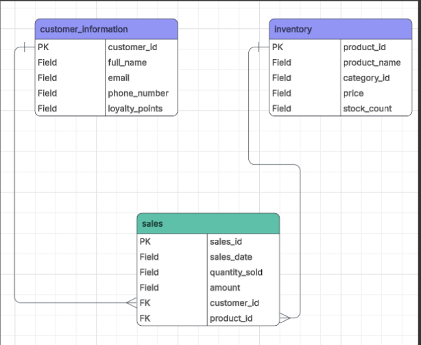
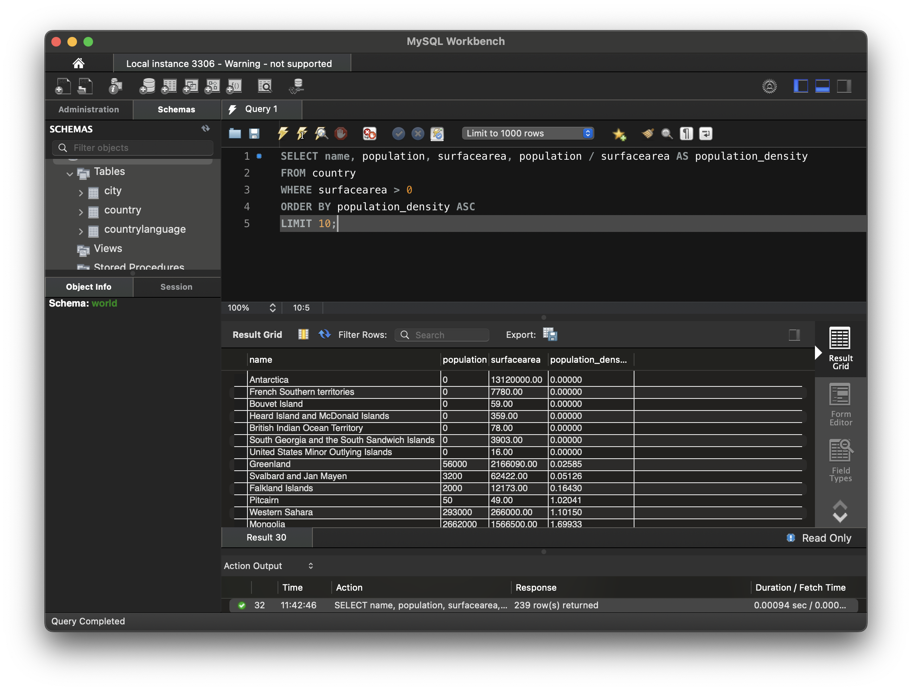

# Data Technician Workbook 3

## Overview

I improved my knowledge of relational database design, SQL querying, and fundamental database principles in this workbook. Primary keys, foreign keys, one-to-one, one-to-many, and many-to-many relationships, as well as the distinction between relational and non-relational databases, were among the important subjects I discussed. Additionally, I looked into several SQL JOIN types and described how similar data may be connected and analysed using them.

I then created a database for a corner store using these ideas in a retail database situation. I planned the structure for customer, inventory, and sales tables, specified links between them, and wrote SQL commands to create and populate the database. Additionally, I investigated the use of backups, security measures, access limits, and validation to preserve database accuracy.

I used the global database to do actual SQL tasks in addition to the textual work. In order to respond to business type enquiries, this involved acquiring, filtering, sorting, grouping, and merging data. I improved my knowledge of database design, SQL querying, data linkages, and utilising structured data to aid in analysis and decision-making.

## Topics Covered

- Database design
- Table relationships and keys
- SQL joins
- Creating and populating databases
- SQL querying
- Data validation and security

Project Visuals:

 
 
